---
## Front matter
title: "Отчет по лабораторной работе №4"
subtitle: "Дисциплина: архитектура компьютера"
author: "Учаева Алёна Сергеевна"

## Generic otions
lang: ru-RU
toc-title: "Содержание"

## Bibliography
bibliography: bib/cite.bib
csl: pandoc/csl/gost-r-7-0-5-2008-numeric.csl

## Pdf output format
toc: true # Table of contents
toc-depth: 2
lof: true # List of figures
fontsize: 12pt
linestretch: 1.5
papersize: a4
documentclass: scrreprt
## I18n polyglossia
polyglossia-lang:
  name: russian
  options:
	- spelling=modern
	- babelshorthands=true
polyglossia-otherlangs:
  name: english
## I18n babel
babel-lang: russian
babel-otherlangs: english
## Fonts
mainfont: IBM Plex Serif
romanfont: IBM Plex Serif
sansfont: IBM Plex Sans
monofont: IBM Plex Mono
mathfont: STIX Two Math
mainfontoptions: Ligatures=Common,Ligatures=TeX,Scale=0.94
romanfontoptions: Ligatures=Common,Ligatures=TeX,Scale=0.94
sansfontoptions: Ligatures=Common,Ligatures=TeX,Scale=MatchLowercase,Scale=0.94
monofontoptions: Scale=MatchLowercase,Scale=0.94,FakeStretch=0.9
mathfontoptions:
## Biblatex
biblatex: true
biblio-style: "gost-numeric"
biblatexoptions:
  - parentracker=true
  - backend=biber
  - hyperref=auto
  - language=auto
  - autolang=other*
  - citestyle=gost-numeric
## Pandoc-crossref LaTeX customization
figureTitle: "Рис."
tableTitle: "Таблица"
listingTitle: "Листинг"
lofTitle: "Список иллюстраций"
lolTitle: "Листинги"
## Misc options
indent: true
header-includes:
  - \usepackage{indentfirst}
  - \usepackage{float} # keep figures where there are in the text
  - \floatplacement{figure}{H} # keep figures where there are in the text
---

# Цель работы

Целью работы является освоение процедуры компиляции и сборки программ, написанных на ассемблере NASM.

# Задание

1. Создание программы Hello world!
2. Работа с транслятором NASM
3. Работа с расширенным синтаксисом командной строки NASM
4. Работа с компоновщиком LD
5. Запуск исполняемого файла
6. Выполнение заданий для самостоятельной работы

# Теоретическое введение

Основными функциональными элементами любой электронно-вычислительной машины
(ЭВМ) являются центральный процессор, память и периферийные устройства (рис. 4.1).
Взаимодействие этих устройств осуществляется через общую шину, к которой они подклю-
чены. Физически шина представляет собой большое количество проводников, соединяющих
устройства друг с другом. В современных компьютерах проводники выполнены в виде элек-
тропроводящих дорожек на материнской (системной) плате.
Основной задачей процессора является обработка информации, а также организация
координации всех узлов компьютера. В состав центрального процессора (ЦП) входят
следующие устройства:
• арифметико-логическое устройство (АЛУ) — выполняет логические и арифметиче-
ские действия, необходимые для обработки информации, хранящейся в памяти;
• устройство управления (УУ) — обеспечивает управление и контроль всех устройств
компьютера;
• регистры — сверхбыстрая оперативная память небольшого объёма, входящая в со-
став процессора, для временного хранения промежуточных результатов выполнения
инструкций; регистры процессора делятся на два типа: регистры общего назначения и
специальные регистры.
Для того, чтобы писать программы на ассемблере, необходимо знать, какие регистры
процессора существуют и как их можно использовать. Большинство команд в программах
написанных на ассемблере используют регистры в качестве операндов. Практически все
команды представляют собой преобразование данных хранящихся в регистрах процессора,
это например пересылка данных между регистрами или между регистрами и памятью, пре-
образование (арифметические или логические операции) данных хранящихся в регистрах.
Доступ к регистрам осуществляется не по адресам, как к основной памяти, а по именам.
Каждый регистр процессора архитектуры x86 имеет свое название, состоящее из 2 или 3
букв латинского алфавита.
В качестве примера приведем названия основных регистров общего назначения (именно
эти регистры чаще всего используются при написании программ):
• RAX, RCX, RDX, RBX, RSI, RDI — 64-битные
• EAX, ECX, EDX, EBX, ESI, EDI — 32-битные
• AX, CX, DX, BX, SI, DI — 16-битные
• AH, AL, CH, CL, DH, DL, BH, BL — 8-битные (половинки 16-битных регистров).
Другим важным узлом ЭВМ является оперативное запоминающее устройство (ОЗУ).
ОЗУ — это быстродействующее энергозависимое запоминающее устройство, которое на-
прямую взаимодействует с узлами процессора, предназначенное для хранения программ и
данных, с которыми процессор непосредственно работает в текущий момент. ОЗУ состоит из
одинаковых пронумерованных ячеек памяти. Номер ячейки памяти — это адрес хранящихся
в ней данных.
В состав ЭВМ также входят периферийные устройства, которые можно разделить на:
• устройства внешней памяти, которые предназначены для долговременного хране-
ния больших объёмов данных (жёсткие диски, твердотельные накопители, магнитные
ленты);
• устройства ввода-вывода, которые обеспечивают взаимодействие ЦП с внешней
средой.
В основе вычислительного процесса ЭВМ лежит принцип программного управления.
Это означает, что компьютер решает поставленную задачу как последовательность действий,
записанных в виде программы. Программа состоит из машинных команд, которые указыва-
ют, какие операции и над какими данными (или операндами), в какой последовательности
необходимо выполнить.
Набор машинных команд определяется устройством конкретного процессора. Коды ко-
манд представляют собой многоразрядные двоичные комбинации из 0 и 1. В коде машинной
команды можно выделить две части: операционную и адресную. В операционной части хра-
нится код команды, которую необходимо выполнить. В адресной части хранятся данные
или адреса данных, которые участвуют в выполнении данной операции.
При выполнении каждой команды процессор выполняет определённую последователь-
ность стандартных действий, которая называется командным циклом процессора. В
самом общем виде он заключается в следующем:
1. формирование адреса в памяти очередной команды;
2. считывание кода команды из памяти и её дешифрация;
3. выполнение команды;
4. переход к следующей команде.
Язык ассемблера (assembly language, сокращённо asm) — машинно-ориентированный
язык низкого уровня.
NASM — это открытый проект ассемблера, версии которого доступны под различные
операционные системы и который позволяет получать объектные файлы для этих систем. В
NASM используется Intel-синтаксис и поддерживаются инструкции x86-64.

# Выполнение лабораторной работы
## Создание программы Hello world!

Перемещаюсь в каталог, в котором буду работать и создаю пустой текстовый файл hello.asm с помощью команды touch (рис. [-@fig:001]).

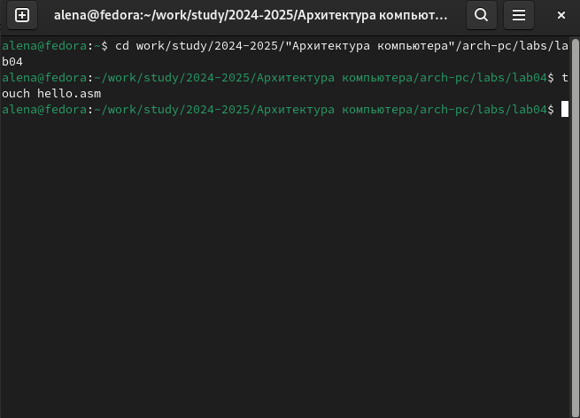{#fig:001 width=70%}

Открываю созданный файл в текстовом редакторе (рис. [-@fig:002]).

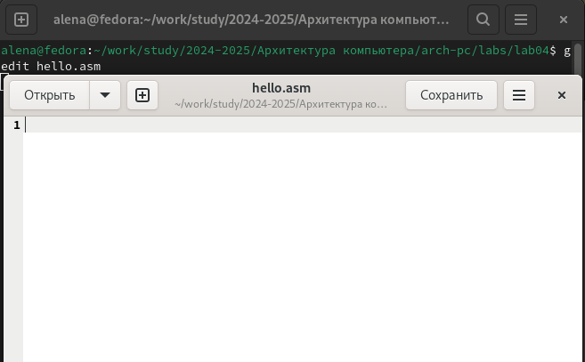{#fig:002 width=70%}

Заполняю файл вставляя в него программу для вывода Hello world! (рис. [-@fig:003]).

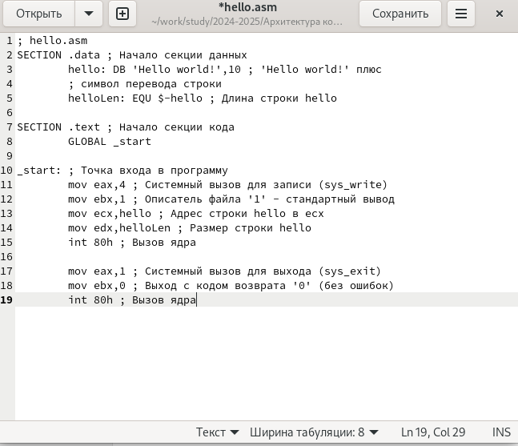{#fig:003 width=70%}

## Работа с транслятором NASM 

Превращаю текст программы "Hello world!" в объектный код с помощью транслятора NASM и с помощью команды ls проверяю, что объектный файл был создан (рис. [-@fig:004]).

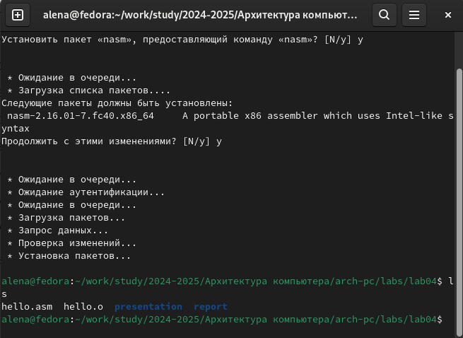{#fig:004 width=70%}

## Работа с расширенным синтаксисом командной строки NASM

Далее ввожу команду,которая скомпилирует файл hello.asm в файл obj.o,при этом в файл будут включены символы для отладки и будет создан файл листинга list.lst,затем проверяю корректность выполненых действий (рис. [-@fig:005]).

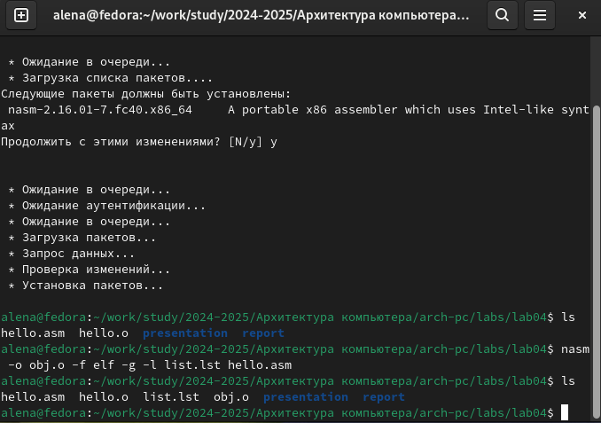{#fig:005 width=70%}

## Работа с компоновщиком LD

Передаю объектный файл на обработку компановщику LD,чтобы получить исполняемый файл hello и проверяю корректность, с помощью команды ls (рис. [-@fig:006]).

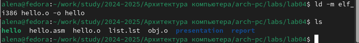{#fig:006 width=70%}

Выполняю команду (рис. [-@fig:007]). Исполняемый файл будет иметь имя main, так как после ключа -о было задано значение main. Объектвный файл из которого собран этот исполняемый файл, имеет имя obj.o.

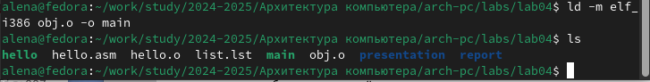{#fig:007 width=70%}

## Запуск исполняемого файла

Запускаю на выполнение созданный исполняемый файл hello (рис. [-@fig:008]).

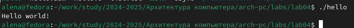{#fig:008 width=70%}

## Выполнение заданий для самостоятельной работы

С помощью команды cp создаю в текущем каталоге копию файла hello.asm с именем lab4.asm (рис. [-@fig:009]).

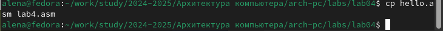{#fig:009 width=70%}

С помощью текстового редактора открываю файл lab4.asm и вношу изменения в программу, чтобы она выводила мои имя и фамилию (рис. [-@fig:010]).

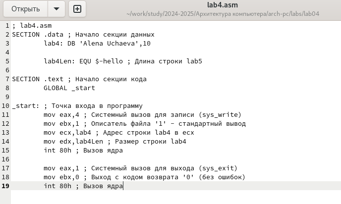{#fig:010 width=70%}

Компилирую текст программы в объектный файл и проверяю корректность действий (рис. [-@fig:011]).

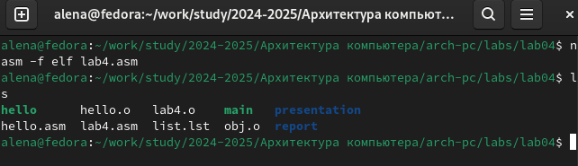{#fig:011 width=70%}

Передаю объектный файл lab4.o на обработку компановщику LD, чтобы получить исполняемый файл lab4 (рис. [-@fig:012]).

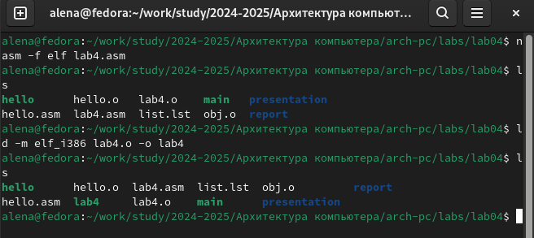{#fig:012 width=70%}

Запускаю исполняемый файл lab4,на экран выводятся мои имя и фамилия (рис. [-@fig:013]).

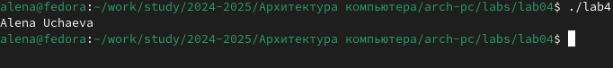{#fig:013 width=70%}

# Выводы

При выполнении данной лабораторной работы я освоила процедуры компиляции и сборки программ, написанных на ассемблере NASM.

# Список литературы{.unnumbered}

1.[Архитектура ЭВМ](https://esystem.rudn.ru/pluginfile.php/2089084/mod_resource/content/0/Лабораторная%20работа%20№4.%20Создание%20и%20процесс%20обработки%20программ%20на%20языке%20ассемблера%20NASM.pdf)
