---
## Front matter
title: "Отчет по лабораторной работе №5"
subtitle: "Дисциплина: архитектура компьютера"
author: "Учаева Алёна Сергеевна"

## Generic otions
lang: ru-RU
toc-title: "Содержание"

## Bibliography
bibliography: bib/cite.bib
csl: pandoc/csl/gost-r-7-0-5-2008-numeric.csl

## Pdf output format
toc: true # Table of contents
toc-depth: 2
lof: true # List of figures
fontsize: 12pt
linestretch: 1.5
papersize: a4
documentclass: scrreprt
## I18n polyglossia
polyglossia-lang:
  name: russian
  options:
	- spelling=modern
	- babelshorthands=true
polyglossia-otherlangs:
  name: english
## I18n babel
babel-lang: russian
babel-otherlangs: english
## Fonts
mainfont: IBM Plex Serif
romanfont: IBM Plex Serif
sansfont: IBM Plex Sans
monofont: IBM Plex Mono
mathfont: STIX Two Math
mainfontoptions: Ligatures=Common,Ligatures=TeX,Scale=0.94
romanfontoptions: Ligatures=Common,Ligatures=TeX,Scale=0.94
sansfontoptions: Ligatures=Common,Ligatures=TeX,Scale=MatchLowercase,Scale=0.94
monofontoptions: Scale=MatchLowercase,Scale=0.94,FakeStretch=0.9
mathfontoptions:
## Biblatex
biblatex: true
biblio-style: "gost-numeric"
biblatexoptions:
  - parentracker=true
  - backend=biber
  - hyperref=auto
  - language=auto
  - autolang=other*
  - citestyle=gost-numeric
## Pandoc-crossref LaTeX customization
figureTitle: "Рис."
listingTitle: "Листинг"
lofTitle: "Список иллюстраций"
lolTitle: "Листинги"
## Misc options
indent: true
header-includes:
  - \usepackage{indentfirst}
  - \usepackage{float} # keep figures where there are in the text
  - \floatplacement{figure}{H} # keep figures where there are in the text
---

# Цель работы

Целью лабораторной работы является приобретение практических навыков работы в Midnight Commander. Освоение инструкций языка ассемблера mov и int.

# Задание

1. Основы работы с mc
2. Структура программы на языке ассемблера NASM
3. Подключение внешнего файла
4. Выполнение заданий для самостоятельной работы

# Теоретическое введение

Midnight Commander (или просто mc) — это программа, которая позволяет просматривать
структуру каталогов и выполнять основные операции по управлению файловой системой,
т.е. mc является файловым менеджером. Midnight Commander позволяет сделать работу с
файлами более удобной и наглядной.
Программа на языке ассемблера NASM, как правило, состоит из трёх секций: секция кода
программы (SECTION .text), секция инициированных (известных во время компиляции)
данных (SECTION .data) и секция неинициализированных данных (тех, под которые во
время компиляции только отводится память, а значение присваивается в ходе выполнения
программы) (SECTION .bss).
Для объявления инициированных данных в секции .data используются директивы DB, DW,
DD, DQ и DT, которые резервируют память и указывают, какие значения должны храниться в этой памяти:
• DB (define byte) — определяет переменную размером в 1 байт;
• DW (define word) — определяет переменную размеров в 2 байта (слово);
• DD (define double word) — определяет переменную размером в 4 байта (двойное слово);
• DQ (define quad word) — определяет переменную размером в 8 байт (учетверённое слово);
• DT (define ten bytes) — определяет переменную размером в 10 байт.
Инструкция языка ассемблера mov предназначена для дублирования данных источника в
приёмнике. В общем виде эта инструкция записывается в виде
mov dst,src
Здесь операнд dst — приёмник, а src — источник.
В качестве операнда могут выступать регистры (register), ячейки памяти (memory) и непосредственные значения (const). 
Инструкция языка ассемблера intпредназначена для вызова прерывания с указанным
номером. В общем виде она записывается в виде
int n
Здесь n — номер прерывания, принадлежащий диапазону 0–255

# Выполнение лабораторной работы
## Основы работы с mc

Открываю Midnight Commander, с помощью команды mc (рис. [-@fig:001]).

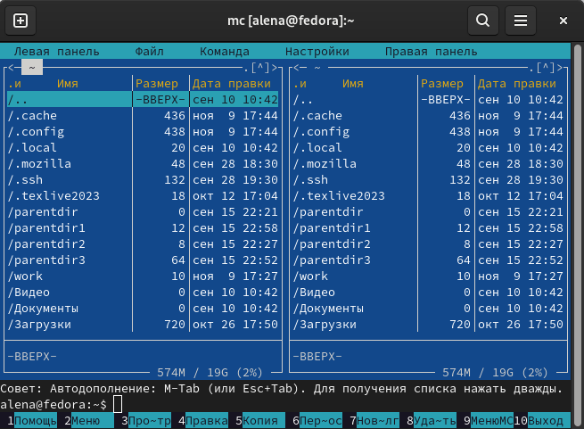{#fig:001 width=70%}

Перехожу в каталог ~/work/study/2024-2025/Архитектура компьютера/arch-pc (рис. [-@fig:002]).

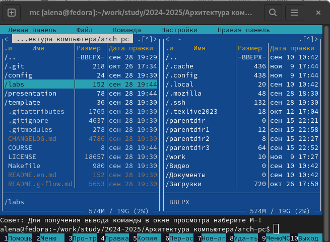{#fig:002 width=70%}

Создаю каталог lab05 с помощью функциональной клавиши F7 (рис. [-@fig:003]).

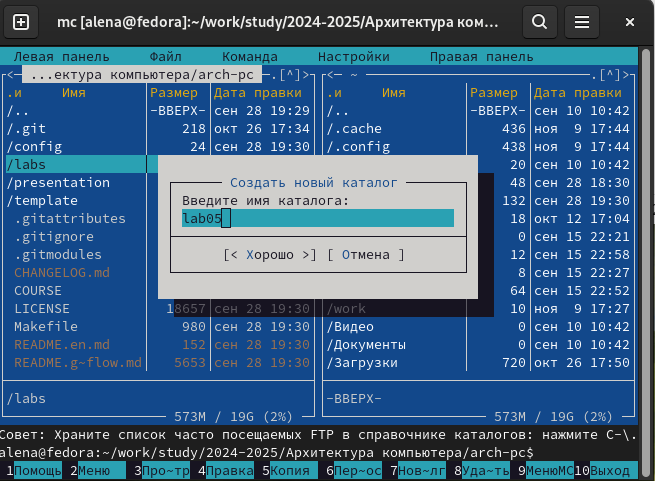{#fig:003 width=70%}

Перехожу в созданный каталог и в строке ввода прописываю команду touch lab5-1.asm, чтобы создать файл (рис. [-@fig:004]).

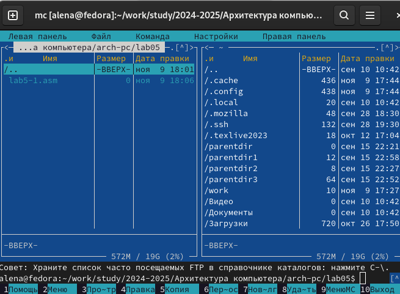{#fig:004 width=70%}

## Структура программы на языке ассемблера NASM

С помощью функциональной клавиши открываю созданный файл для редактирования во встроенном редакторе (рис. [-@fig:005]).

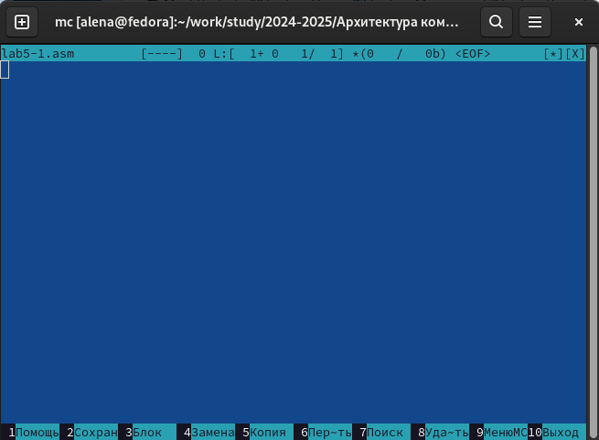{#fig:005 width=70%}

Далее ввожу код программы, сохраняю изменения и сохраняю файл (рис. [-@fig:006]).

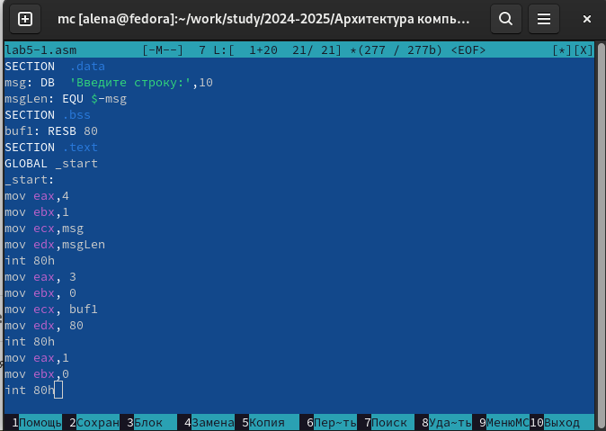{#fig:006 width=70%}

С помощью функциональной клавиши F3 открываю файл и провреяю, что файл содержит текст программы (рис. [-@fig:007]).

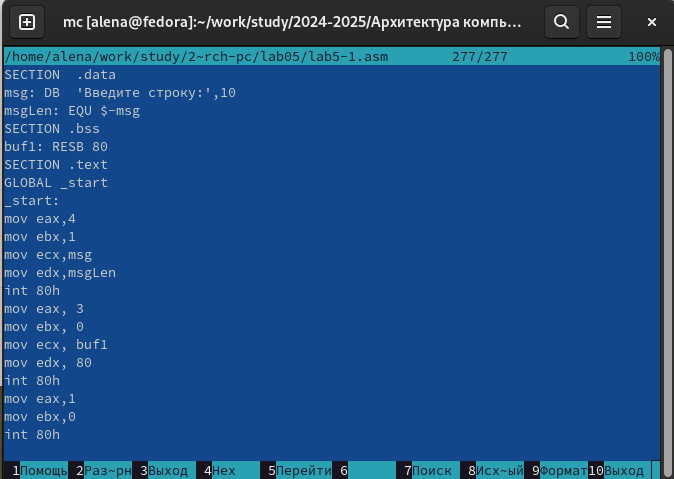{#fig:007 width=70%}

Транслирую текст программы в объектный файл. Выполняю компоновку объектного файла и запускаю получившийся исполняемый файл. На запрос ввожу свое ФИО (рис. [-@fig:008]).

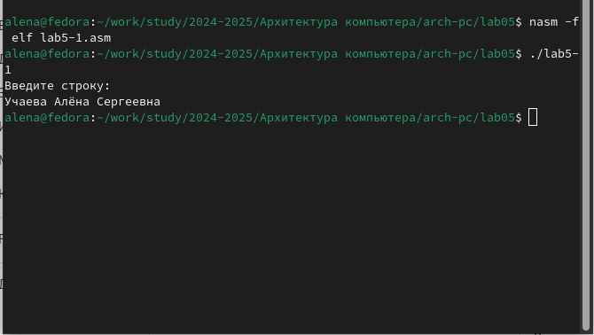{#fig:008 width=70%}

## Подключение внешнего файла

Скачиваю файл in_out.asm со страницы курса в ТУИС и перемещаю в созданный каталог lab05 (рис. [-@fig:009]).

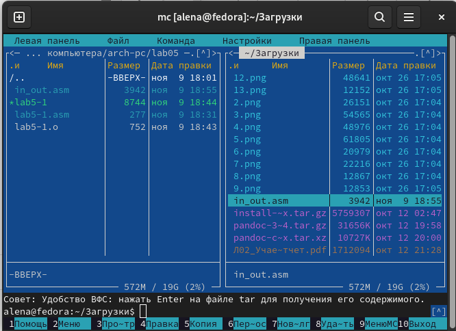{#fig:009 width=70%}

С помощью функциональной клавиши F5 создаю копию файла с другим именем (рис. [-@fig:010]).

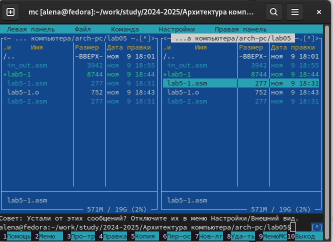{#fig:010 width=70%}

Исправляю текст программы в файле lab5-2.asm (рис. [-@fig:011]).

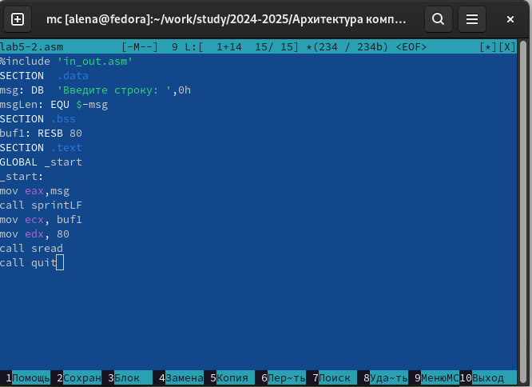{#fig:011 width=70%}

Транслирую текст программы в объектный файл. Выполняю компоновку объектного файла и запускаю получившийся исполняемый файл. На запрос ввожу свое ФИО (рис. [-@fig:012]).

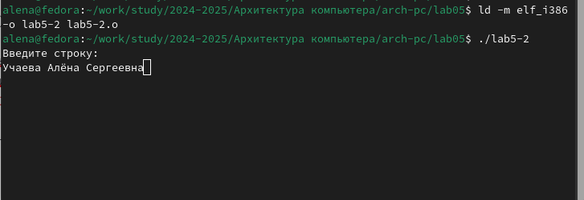{#fig:012 width=70%}

В файле lab5-2.asm заменяю подпрограмму sprintLF на sprint, создаю исполняемый файл и проверяю его работу (рис. [-@fig:013]).

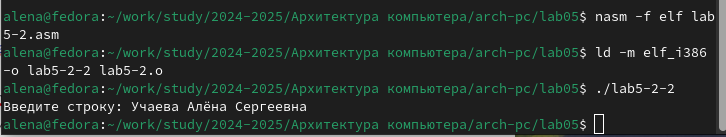{#fig:013 width=70%}

Разница между первым исполняемым файлом и вторым в том, что запуск первого файла запрашивает ввод с новой строки, а второго запрашивает ввод без перехода на новую строку

## Выполнение заданий для самостоятельной работы

Создаю копию файла lab5-1.asm и вношу изменения в программу (рис. [-@fig:014]).

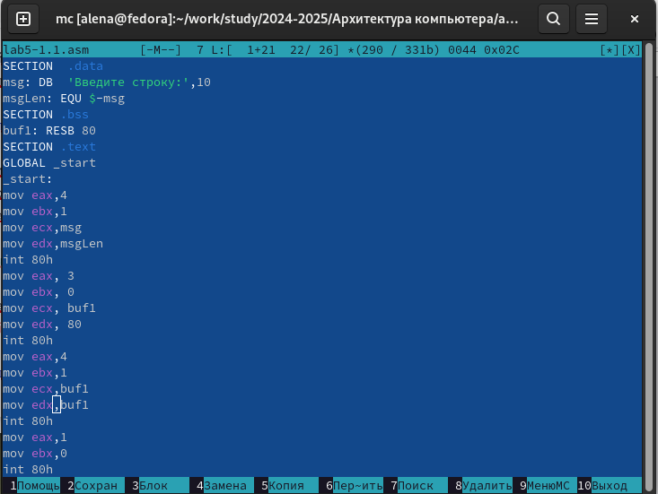{#fig:014 width=70%}

Транслирую текст программы в объектный файл. Выполняю компоновку объектного файла и запускаю получившийся исполняемый файл. На запрос ввожу свое ФИО (рис. [-@fig:015]).

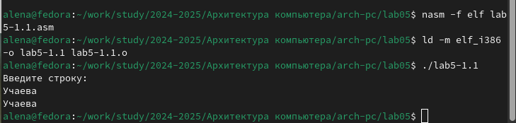{#fig:015 width=70%}

Создаю копию файла lab5-2.asm, исправляю текст программы с использованием подпрограмм из внешнего файла n_out.asm (рис. [-@fig:016]).

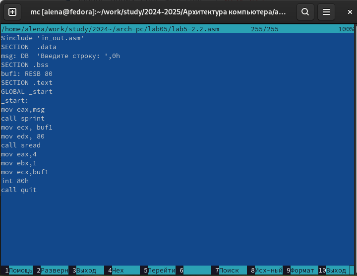{#fig:016 width=70%}

Транслирую текст программы в объектный файл. Выполняю компоновку объектного файла и запускаю получившийся исполняемый файл. На запрос ввожу свое ФИО (рис. [-@fig:017]).

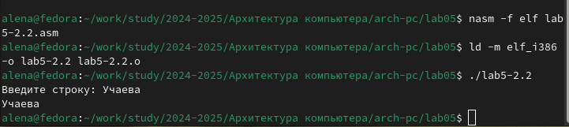{#fig:017 width=70%}

# Выводы

При выполнении данной лабораторной работы я приобрела практические навыки работы в Midnight Commander,освоила инструкции языка ассемблера mov и int.

# Список литературы{.unnumbered}

1. [Архитектура ЭВМ](https://esystem.rudn.ru/pluginfile.php/2089085/mod_resource/content/0/%D0%9B%D0%B0%D0%B1%D0%BE%D1%80%D0%B0%D1%82%D0%BE%D1%80%D0%BD%D0%B0%D1%8F%20%D1%80%D0%B0%D0%B1%D0%BE%D1%82%D0%B0%20%E2%84%965.%20%D0%9E%D1%81%D0%BD%D0%BE%D0%B2%D1%8B%20%D1%80%D0%B0%D0%B1%D0%BE%D1%82%D1%8B%20%D1%81%20Midnight%20Commander%20%28%29.%20%D0%A1%D1%82%D1%80%D1%83%D0%BA%D1%82%D1%83%D1%80%D0%B0%20%D0%BF%D1%80%D0%BE%D0%B3%D1%80%D0%B0%D0%BC%D0%BC%D1%8B%20%D0%BD%D0%B0%20%D1%8F%D0%B7%D1%8B%D0%BA%D0%B5%20%D0%B0%D1%81%D1%81%D0%B5%D0%BC%D0%B1%D0%BB%D0%B5%D1%80%D0%B0%20NASM.%20%D0%A1%D0%B8%D1%81%D1%82%D0%B5%D0%BC%D0%BD%D1%8B%D0%B5%20%D0%B2%D1%8B%D0%B7%D0%BE%D0%B2%D1%8B%20%D0%B2%20%D0%9E%D0%A1%20GNU%20Linux.pdf)
