---
## Front matter
title: "Отчёт по лабораторной работе №6"
subtitle: "Дисциплина: архитектура компьютера"
author: "Учаева Алёна Сергеевна"

## Generic otions
lang: ru-RU
toc-title: "Содержание"

## Bibliography
bibliography: bib/cite.bib
csl: pandoc/csl/gost-r-7-0-5-2008-numeric.csl

## Pdf output format
toc: true # Table of contents
toc-depth: 2
lof: true # List of figures
fontsize: 12pt
linestretch: 1.5
papersize: a4
documentclass: scrreprt
## I18n polyglossia
polyglossia-lang:
  name: russian
  options:
	- spelling=modern
	- babelshorthands=true
polyglossia-otherlangs:
  name: english
## I18n babel
babel-lang: russian
babel-otherlangs: english
## Fonts
mainfont: IBM Plex Serif
romanfont: IBM Plex Serif
sansfont: IBM Plex Sans
monofont: IBM Plex Mono
mathfont: STIX Two Math
mainfontoptions: Ligatures=Common,Ligatures=TeX,Scale=0.94
romanfontoptions: Ligatures=Common,Ligatures=TeX,Scale=0.94
sansfontoptions: Ligatures=Common,Ligatures=TeX,Scale=MatchLowercase,Scale=0.94
monofontoptions: Scale=MatchLowercase,Scale=0.94,FakeStretch=0.9
mathfontoptions:
## Biblatex
biblatex: true
biblio-style: "gost-numeric"
biblatexoptions:
  - parentracker=true
  - backend=biber
  - hyperref=auto
  - language=auto
  - autolang=other*
  - citestyle=gost-numeric
## Pandoc-crossref LaTeX customization
figureTitle: "Рис."
listingTitle: "Листинг"
lofTitle: "Список иллюстраций"
lolTitle: "Листинги"
## Misc options
indent: true
header-includes:
  - \usepackage{indentfirst}
  - \usepackage{float} # keep figures where there are in the text
  - \floatplacement{figure}{H} # keep figures where there are in the text
---

# Цель работы

Цель данной лабораторной работы освоить арифметические инструкции языка ассемблера NASM.

# Задание

1. Символьные и численные данные в NASM
2. Выполнение арифметических операций в NASM
3. Выполнение заданий для самостоятельной работы

# Теоретическое введение

Большинство инструкций на языке ассемблера требуют обработки операндов. Адрес опе-
ранда предоставляет место, где хранятся данные, подлежащие обработке. Это могут быть
данные хранящиеся в регистре или в ячейке памяти. Далее рассмотрены все существующие
способы задания адреса хранения операндов – способы адресации.
Существует три основных способа адресации:
• Регистровая адресация – операнды хранятся в регистрах и в команде используются
имена этих регистров, например: mov ax,bx.
• Непосредственная адресация – значение операнда задается непосредственно в ко-
манде, Например: mov ax,2.
• Адресация памяти – операнд задает адрес в памяти. В команде указывается символи-
ческое обозначение ячейки памяти, над содержимым которой требуется выполнить
операцию.
Ввод информации с клавиатуры и вывод её на экран осуществляется в символьном виде.
Кодирование этой информации производится согласно кодовой таблице символов ASCII.
ASCII – сокращение от American Standard Code for Information Interchange (Американский
стандартный код для обмена информацией). Согласно стандарту ASCII каждый символ
кодируется одним байтом.
Среди инструкций NASM нет такой, которая выводит числа (не в символьном виде). По-
этому, например, чтобы вывести число, надо предварительно преобразовать его цифры в
ASCII-коды этих цифр и выводить на экран эти коды, а не само число. Если же выводить число
на экран непосредственно, то экран воспримет его не как число, а как последовательность
ASCII-символов – каждый байт числа будет воспринят как один ASCII-символ – и выведет на
экран эти символы.
Аналогичная ситуация происходит и при вводе данных с клавиатуры. Введенные дан-
ные будут представлять собой символы, что сделает невозможным получение корректного
результата при выполнении над ними арифметических операций.
Для решения этой проблемы необходимо проводить преобразование ASCII символов в
числа и обратно.


# Выполнение лабораторной работы
## Символьные и численные данные в NASM

С помощью команды mkdir создаю каталог для программ лабораторной работы №6, перехожу в него и создаю файл lab6-1.asm (рис. [-@fig:001]).

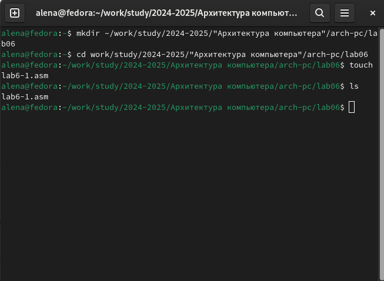{#fig:001 width=70%}

Открываю созданный файл lab6-1.asm, вставляю в него программу вывода значения регистра eax (рис. [-@fig:002]).

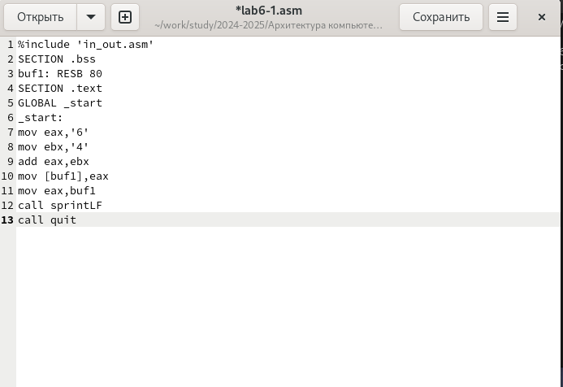{#fig:002 width=70%}

Создаю исполняемый файл программы и запускаю его (рис. [-@fig:003]).

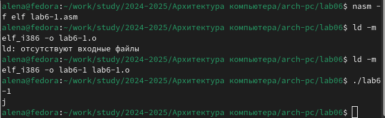{#fig:003 width=70%}

Далее изменяю текст программы, вместо символов записываю в регистры числа (рис. [-@fig:004]).

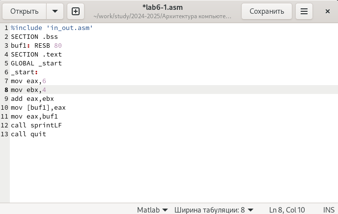{#fig:004 width=70%}

Создаю исполняемый файл и запускаю его (рис. [-@fig:005]). Вывелся симыол с кодом 10,это символ перевода строки,этот символ не отображается при выводе на экран.

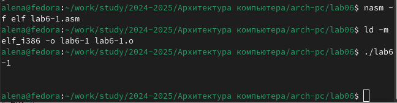{#fig:005 width=70%}

С помощью команды touch создаю файл lab6-2.asm и ввожу в него текст программы (рис. [-@fig:006]).

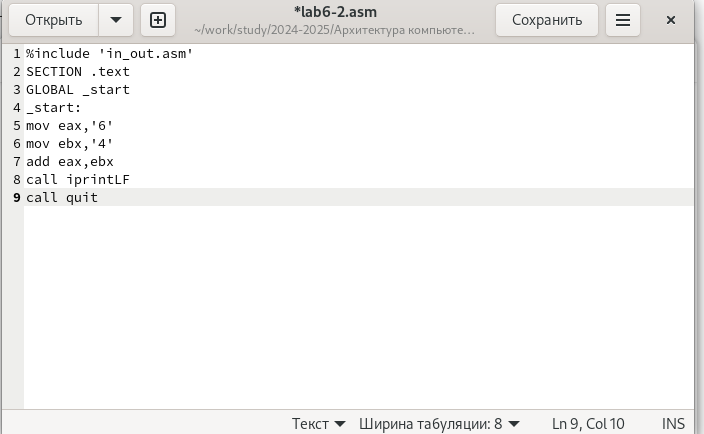{#fig:006 width=70%}

Создаю исполняемый файл и запускаю его (рис. [-@fig:007]).

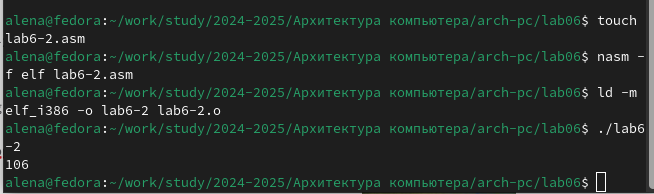{#fig:007 width=70%}

Далее изменяю символы на числа (рис. [-@fig:008]).

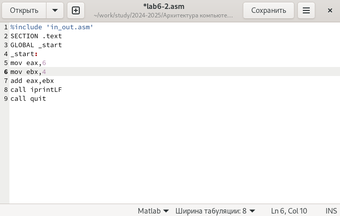{#fig:008 width=70%}

Создаю и запусааю исполняемый файл (рис. [-@fig:009]). Теперь программа складывает не соответствующие символам коды в системе ASCII, а сами числа, поэтому выводит 10.

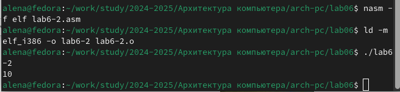{#fig:009 width=70%}

Заменяю функцию iprintLF на Iprint (рис. [-@fig:010]).

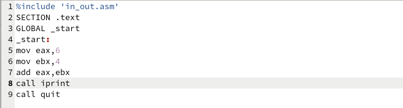{#fig:010 width=70%}

Создаю и запускаю исполняемый файл (рис. [-@fig:011]).Вывод не изменился, потому что символ переноса строки не отображался, когда программа исполнялась с функцией iprintLF, а iprint не добавляет к выводу символ переноса строки, в отличие от iprintLF.

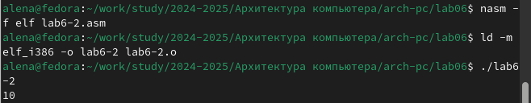{#fig:011 width=70%}

## Выполнение арифметических операций в NASM

Создаю файл lab6-3 с помощью команды touch (рис. [-@fig:012]).

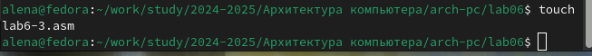{#fig:012 width=70%}

Ввожу текст программы для вычисления выражения 𝑓(𝑥)=(5*2+3)/3 в исполняемый файл (рис. [-@fig:013]).

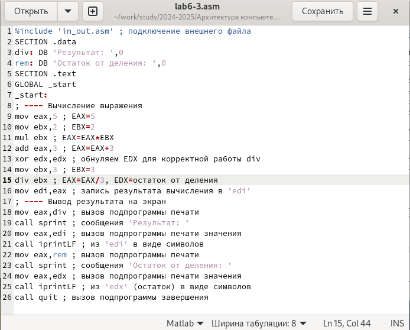{#fig:013 width=70%}

Создаю исполняемый файл и запускаю его (рис. [-@fig:014]).

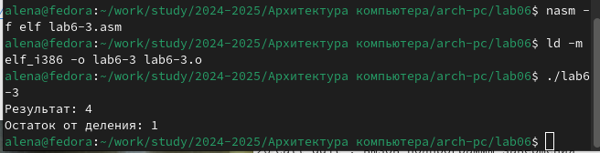{#fig:014 width=70%}

Далее изменяю текст программы для вычисления выражения  𝑓(𝑥)=(4*6+2)/5 (рис. [-@fig:015]). 

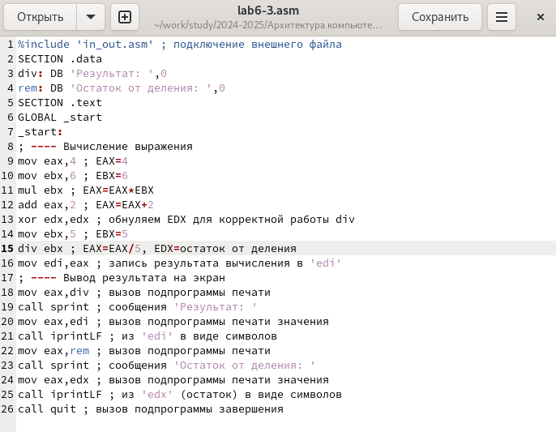{#fig:015 width=70%}

Создаю исполняемый файл и запускаю его (рис. [-@fig:016]).

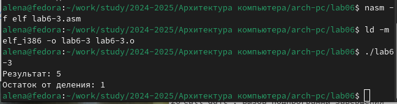{#fig:016 width=70%}

Создаю файл variant.asm (рис. [-@fig:017]).

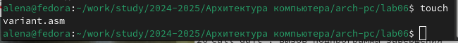{#fig:017 width=70%}

Ввожу в файл текст программы для вычисления варианта задания по номеру
студенческого билета (рис. [-@fig:018]).

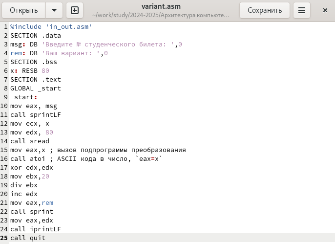{#fig:018 width=70%}

Создаю исполняемый файл и запускаю его (рис. [-@fig:019]).

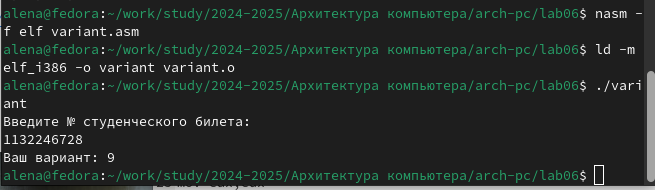{#fig:019 width=70%}

### Ответы на вопросы 
1. За вывод на экран сообщения ‘Ваш вариант:’ отвечают строки:
```NASM
mov eax,rem
call sprint
```
2. Инструкция mov ecx,x используется, чтобы положить адрес вводимой строки x в регистр ecx mov edx,80-запись в регистр edx длины вводимой строки call sread-вызов подпрограммы из внешнего файла,обеспечивающей ввод сообщения с клавиатуры.
3. call atoi используется для вызова подпрограммы из внешнего файла,которая преобразует ASCII-код символа в целое число и записывает результат в регистр eax.
4. За вычисления варианта отвечают строки:
xor edx,edx ; обнуление edx для корректной работы div
```NASM
mov ebx,20 ; ebx=20
div ebx ; eax=eax/20, edx-остаток от деления
inc edx ; edx=edx+1
```
5. При выполнении инструкции div ebx остаток от деления записывается в регистр edx
6. Инструкция inc edx увеличивает значение регистра edx на 1
7. За вывод на экран результатов вычислений отвчают строки:
```NASM
mov eax,edx
call iprintLF
```
## Выполнение заданий для самостоятельной работы

Создаю файл lab6-4.asm (рис. [-@fig:020]).

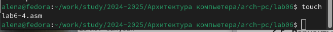{#fig:020 width=70%}

Ввожу в созданный файл текст программы для вычисления 10+(31*x-5) (вариант №9) (рис. [-@fig:021]).

{#fig:021 width=70%}

Создаю исполняемый файл и запускаю его (рис. [-@fig:022]).

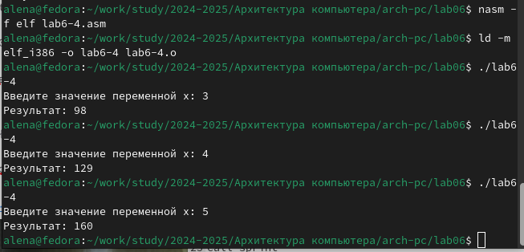{#fig:022 width=70%}

Программа сработала верно

**Листинг программы для вычисления выражения 10+(31*x-5)
```NASM
%include 'in_out.asm'
SECTION .data
msg: DB 'Введите значение переменной x: ',0
rem: DB 'Результат: ',0
SECTION .bss
x: RESB 80
SECTION .text
GLOBAL _start
_start:
; ---- Вычисление выражения
mov eax, msg
call sprint
mov ecx, x
mov edx, 80
call sread
mov eax,x ; вызов подпрограммы преобразования
call atoi ; ASCII кода в число, `eax=x`
mov ebx,31 ; ebx=31
mul ebx ; eax=31*x
add eax,-5 ; eax=eax-5
add eax,10 ; eax=eax+10
mov edi,eax ; запись результата вычисления в 'edi'
; ---- Вывод результата на экран
mov eax,rem
call sprint
mov eax,edi
call iprintLF
call quit
```

# Выводы

При выполнении данной лабораторной работы я освоила арифметические инструкции языка ассемблера NASM.

# Список литературы{.unnumbered}

1. [Архитектура ЭВМ](https://esystem.rudn.ru/pluginfile.php/2089086/mod_resource/content/0/%D0%9B%D0%B0%D0%B1%D0%BE%D1%80%D0%B0%D1%82%D0%BE%D1%80%D0%BD%D0%B0%D1%8F%20%D1%80%D0%B0%D0%B1%D0%BE%D1%82%D0%B0%20%E2%84%966.%20%D0%90%D1%80%D0%B8%D1%84%D0%BC%D0%B5%D1%82%D0%B8%D1%87%D0%B5%D1%81%D0%BA%D0%B8%D0%B5%20%D0%BE%D0%BF%D0%B5%D1%80%D0%B0%D1%86%D0%B8%D0%B8%20%D0%B2%20NASM..pdf)
