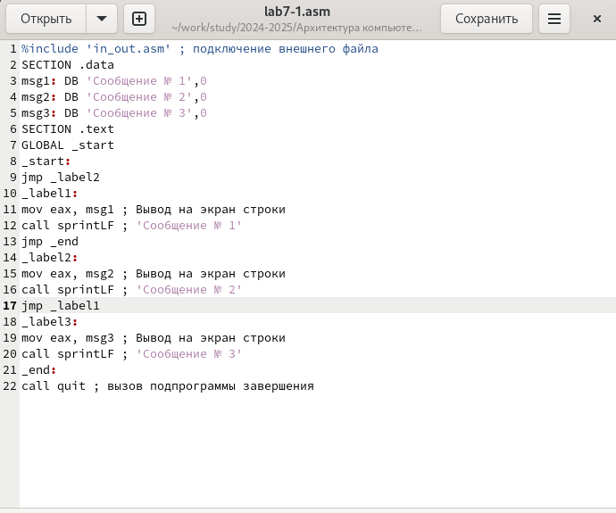
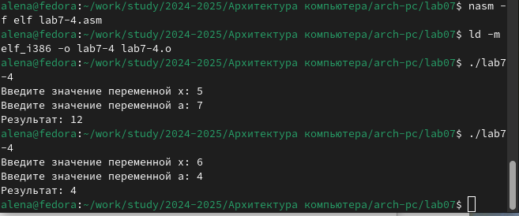

---
## Front matter
title: "Отчёт по лабораторной работе №7"
subtitle: "Дисциплина: архитектура компьютера"
author: "Учаева Алёна Сергеевна"

## Generic otions
lang: ru-RU
toc-title: "Содержание"

## Bibliography
bibliography: bib/cite.bib
csl: pandoc/csl/gost-r-7-0-5-2008-numeric.csl

## Pdf output format
toc: true # Table of contents
toc-depth: 2
lof: true # List of figures
fontsize: 12pt
linestretch: 1.5
papersize: a4
documentclass: scrreprt
## I18n polyglossia
polyglossia-lang:
  name: russian
  options:
	- spelling=modern
	- babelshorthands=true
polyglossia-otherlangs:
  name: english
## I18n babel
babel-lang: russian
babel-otherlangs: english
## Fonts
mainfont: IBM Plex Serif
romanfont: IBM Plex Serif
sansfont: IBM Plex Sans
monofont: IBM Plex Mono
mathfont: STIX Two Math
mainfontoptions: Ligatures=Common,Ligatures=TeX,Scale=0.94
romanfontoptions: Ligatures=Common,Ligatures=TeX,Scale=0.94
sansfontoptions: Ligatures=Common,Ligatures=TeX,Scale=MatchLowercase,Scale=0.94
monofontoptions: Scale=MatchLowercase,Scale=0.94,FakeStretch=0.9
mathfontoptions:
## Biblatex
biblatex: true
biblio-style: "gost-numeric"
biblatexoptions:
  - parentracker=true
  - backend=biber
  - hyperref=auto
  - language=auto
  - autolang=other*
  - citestyle=gost-numeric
## Pandoc-crossref LaTeX customization
figureTitle: "Рис."
listingTitle: "Листинг"
lofTitle: "Список иллюстраций"
lotTitle: "Список таблиц"
lolTitle: "Листинги"
## Misc options
indent: true
header-includes:
  - \usepackage{indentfirst}
  - \usepackage{float} # keep figures where there are in the text
  - \floatplacement{figure}{H} # keep figures where there are in the text
---

# Цель работы

Изучить команды условного и безусловного переходов. Приобретение навыков написания
программ с использованием переходов. Ознакомиться с назначением и структурой файла
листинга.

# Задание

1. Реализация переходов в NASM
2. Изучение структуры файлы листинга
3. Задания для самостоятельной работы 

# Теоретическое введение

Для реализации ветвлений в ассемблере используются так называемые команды передачи
управления или команды перехода. Можно выделить 2 типа переходов:
• условный переход – выполнение или не выполнение перехода в определенную точку
программы в зависимости от проверки условия.
• безусловный переход – выполнение передачи управления в определенную точку про-
граммы без каких-либо условий.


# Выполнение лабораторной работы
## Реализация переходов в NASM

Создаю каталог для программ лабораторной работы №7 (рис. [-@fig:001]).

{#fig:001 width=70%}

Ввожу в файл lab7-1.asm текст программы из листинга 7.1 (рис. [-@fig:002]).

{#fig:002 width=70%}

Создаю исполняемый файл и запускаю его (рис. [-@fig:003]).

{#fig:003 width=70%}

Редактирую программу, чтобы поменялся порядок выполнения функций (рис. [-@fig:004]).

{#fig:004 width=70%}

Создаю исполняемый файл и запускаю его (рис. [-@fig:005]).

{#fig:005 width=70%}

Редактирую текст программы, чтобы сообщения вывелись в обратном порядке (рис. [-@fig:006]).

{#fig:006 width=70%}

Создаю исполняемый файл и запускаю его (рис. [-@fig:007]).

{#fig:007 width=70%}

Создаю файл  lab7-2.asm в каталоге ~/work/arch-pc/lab07 и ввожу в него текст программы из листинга 7.3 (рис. [-@fig:008]).

{#fig:008 width=70%}

Создаю исполняемый файл и запускаю его. Программа выводит значение переменной с максимальным значением, проверяю работу программы с разными входными данными (рис. [-@fig:009]).

{#fig:007 width=70%}

## Изучение структуры файлы листинга

Создаю файл листинга с помощью флага -l команды nasm и открываю его с помощью текстового редактора (рис. [-@fig:010]).

{#fig:010 width=70%}

Строка 5: 5 00000001 89C3
Данная команда перемещает данные из одного регистра в другой, сохраняет начальный адрес строки в регистре ebx.
Строка 8: 00000003 803800
Данная команда проверяет, является ли текущий символ нулевым (конец строки).
Строка 27: 00000013 E8E8FFFFFF
Данная команда вызывает функцию slen, которая вычисляет длину строки.

Далее удаляю один операнд из случайной инструкции (рис. [-@fig:011]).

{#fig:011 width=70%}

Выполняю трансляцию с получением файла листинга, показывает ошибку.Никакие выходные при этом не создаются (рис. [-@fig:012]).

{#fig:012 width=70%}

## Задания для самостоятельной работы

Вариант №9(мой вариант из лабораторной работы №6):

Редактирую программу для нахождения наименьшей из 3 целочисленных переменных (рис. [-@fig:013]).

{#fig:013 width=70%}

Создаю исполняемый файл и запускаю его, программа работает корректно (рис. [-@fig:014]).

{#fig:014 width=70%}

```NASM
%include 'in_out.asm'
SECTION .data
msg1 db 'Введите В: ', 0h
msg2 db 'Наименьшее число: ', 0h
A dd '24'
C dd '15'
SECTION .bss
min resb 10
B resb 10
SECTION .text
GLOBAL _start
_start:
mov eax, msg1
call sprint
mov ecx, B
mov edx, 10
call sread
mov eax, B
call atoi
mov [B], eax
mov ecx, [A]
mov [min], ecx
cmp ecx, [C]
jg check_B
mov ecx, [C]
mov [min], ecx
check_B:
mov eax, min
call atoi
mov [min], eax
mov ecx, [min]
cmp ecx, [B]
jb fin
mov ecx, [B]
mov [min], ecx
fin:
mov eax, msg2
call sprint
mov eax, [min]
call iprintLF
call quit
```
2. Пишу программу, которая вычисляет значение заданной функции и выводит результат вычислений.(рис. [-@fig:015]).

{#fig:015 width=70%}

Создаю исполняемый файл и запускаю его, программа работает корректно (рис. [-@fig:016]).

{#fig:016 width=70%}

```NASM
%include 'in_out.asm'
SECTION .data
msg_x: DB 'Введите значение переменной x: ', 0
msg_a: DB 'Введите значение переменной a: ', 0
res: DB 'Результат: ', 0
SECTION .bss
x: RESB 80
a: RESB 80
SECTION .text
GLOBAL _start
_start:
mov eax, msg_x
call sprint
mov ecx, x
mov edx, 80
call sread
mov eax, x
call atoi
mov edi, eax
mov eax, msg_a
call sprint
mov ecx, a
mov edx, 80
call sread
mov eax, a
call atoi
mov esi, eax
cmp edi, esi
jle add_values
mov eax, esi
jmp print_result
add_values:
mov eax, edi
add eax, esi
print_result:
mov edi, eax
mov eax, res
call sprint
mov eax, edi
call iprintLF
call quit
```
# Выводы

При выполнении данной лабораторной работы я изучила команды условного и безусловного переходов. Приобрела навыки написания программ с использованием переходов. Ознакомилась с назначением и структурой файла листинга.

# Список литературы{.unnumbered}

1. [Архитектура ЭВМ](https://esystem.rudn.ru/pluginfile.php/2089087/mod_resource/content/0/%D0%9B%D0%B0%D0%B1%D0%BE%D1%80%D0%B0%D1%82%D0%BE%D1%80%D0%BD%D0%B0%D1%8F%20%D1%80%D0%B0%D0%B1%D0%BE%D1%82%D0%B0%20%E2%84%967.%20%D0%9A%D0%BE%D0%BC%D0%B0%D0%BD%D0%B4%D1%8B%20%D0%B1%D0%B5%D0%B7%D1%83%D1%81%D0%BB%D0%BE%D0%B2%D0%BD%D0%BE%D0%B3%D0%BE%20%D0%B8%20%D1%83%D1%81%D0%BB%D0%BE%D0%B2%D0%BD%D0%BE%D0%B3%D0%BE%20%D0%BF%D0%B5%D1%80%D0%B5%D1%85%D0%BE%D0%B4%D0%BE%D0%B2%20%D0%B2%20Nasm.%20%D0%9F%D1%80%D0%BE%D0%B3%D1%80%D0%B0%D0%BC%D0%BC%D0%B8%D1%80%D0%BE%D0%B2%D0%B0%D0%BD%D0%B8%D0%B5%20%D0%B2%D0%B5%D1%82%D0%B2%D0%BB%D0%B5%D0%BD%D0%B8%D0%B9..pdf)
