---
## Front matter
title: "Отчёт по лабораторной работе №8"
subtitle: "Дисциплина: архитектура компьютера"
author: "Учаева Алёна Сергеевна"

## Generic otions
lang: ru-RU
toc-title: "Содержание"

## Bibliography
bibliography: bib/cite.bib
csl: pandoc/csl/gost-r-7-0-5-2008-numeric.csl

## Pdf output format
toc: true # Table of contents
toc-depth: 2
lof: true # List of figures
fontsize: 12pt
linestretch: 1.5
papersize: a4
documentclass: scrreprt
## I18n polyglossia
polyglossia-lang:
  name: russian
  options:
	- spelling=modern
	- babelshorthands=true
polyglossia-otherlangs:
  name: english
## I18n babel
babel-lang: russian
babel-otherlangs: english
## Fonts
mainfont: IBM Plex Serif
romanfont: IBM Plex Serif
sansfont: IBM Plex Sans
monofont: IBM Plex Mono
mathfont: STIX Two Math
mainfontoptions: Ligatures=Common,Ligatures=TeX,Scale=0.94
romanfontoptions: Ligatures=Common,Ligatures=TeX,Scale=0.94
sansfontoptions: Ligatures=Common,Ligatures=TeX,Scale=MatchLowercase,Scale=0.94
monofontoptions: Scale=MatchLowercase,Scale=0.94,FakeStretch=0.9
mathfontoptions:
## Biblatex
biblatex: true
biblio-style: "gost-numeric"
biblatexoptions:
  - parentracker=true
  - backend=biber
  - hyperref=auto
  - language=auto
  - autolang=other*
  - citestyle=gost-numeric
## Pandoc-crossref LaTeX customization
figureTitle: "Рис."
tableTitle: "Таблица"
listingTitle: "Листинг"
lofTitle: "Список иллюстраций"
lolTitle: "Листинги"
## Misc options
indent: true
header-includes:
  - \usepackage{indentfirst}
  - \usepackage{float} # keep figures where there are in the text
  - \floatplacement{figure}{H} # keep figures where there are in the text
---

# Цель работы

Приобрести навыки написания программ с использованием циклов и обработкой
аргументов командной строки.

# Задание

1. Реализация циклов в NASM
2. Обработка аргументов командной строки
3. Задание для самостоятельной работы

# Теоретическое введение

Стек — это структура данных, организованная по принципу LIFO («Last In — First Out»
или «последним пришёл — первым ушёл»). Стек является частью архитектуры процессора и
реализован на аппаратном уровне. Для работы со стеком в процессоре есть специальные
регистры (ss, bp, sp) и команды.
Основной функцией стека является функция сохранения адресов возврата и передачи
аргументов при вызове процедур. Кроме того, в нём выделяется память для локальных
переменных и могут временно храниться значения регистров.
Стек имеет вершину, адрес последнего добавленного элемента, который хранится в ре-
гистре esp (указатель стека). Противоположный конец стека называется дном. Значение,
помещённое в стек последним, извлекается первым. При помещении значения в стек указа-
тель стека уменьшается, а при извлечении — увеличивается.
Для стека существует две основные операции:
• добавление элемента в вершину стека (push);
• извлечение элемента из вершины стека (pop).

# Выполнение лабораторной работы
## Реализация циклов в NASM

Создаю каталог для программ лабораторной работы №8(рис. [-@fig:001]).

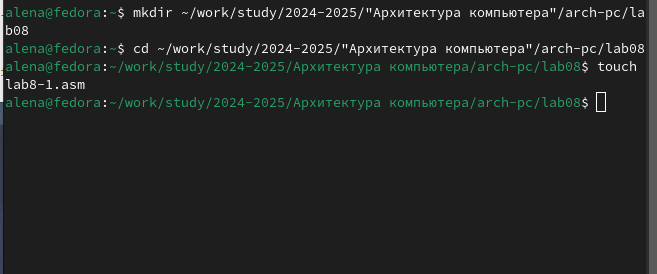{#fig:001 width=70%}

В созданный файл копирую программу из листинга(рис. [-@fig:002]).

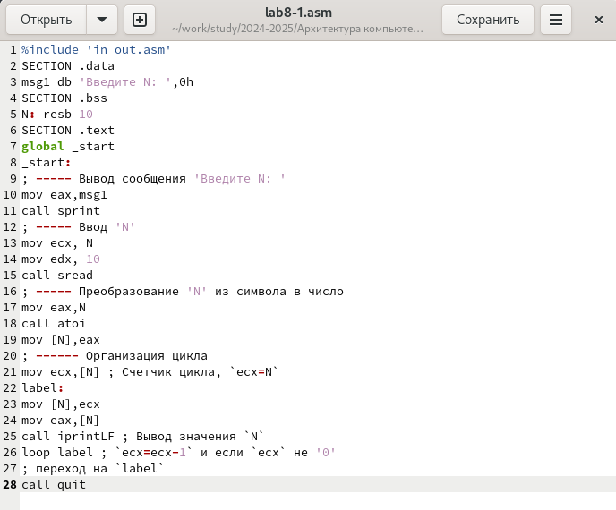{#fig:002 width=70%}

Создаю исполняемый файл и запускаю его, программа показывает работу циклов в NASM(рис. [-@fig:003]).

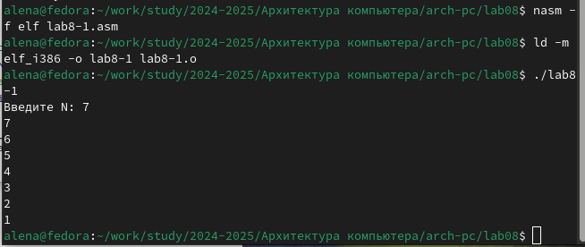{#fig:003 width=70%}

Изменяю текст программы, добавляю изменения значения регистра ecx в цикле(рис. [-@fig:004]).

{#fig:004 width=70%}

Создаю исполняемый файл и запускаю его, теперь ecx на каждой итерации уменьшается на 2 значения, количество итераций уменьшается вдвое(рис. [-@fig:005]).

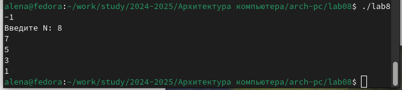{#fig:005 width=70%}

Добавляю команды push и pop в программу(рис. [-@fig:006]).

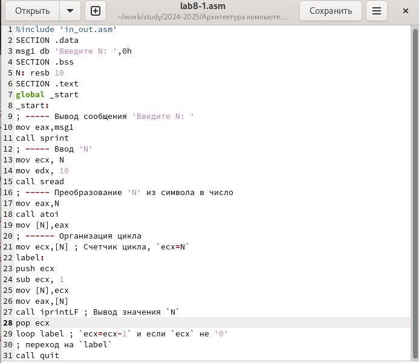{#fig:006 width=70%}

Создаю исполняемый файл и запускаю его, количество итераций совпадает введенному N, но произошло смещение выводимых чисел на -1(рис. [-@fig:007]).

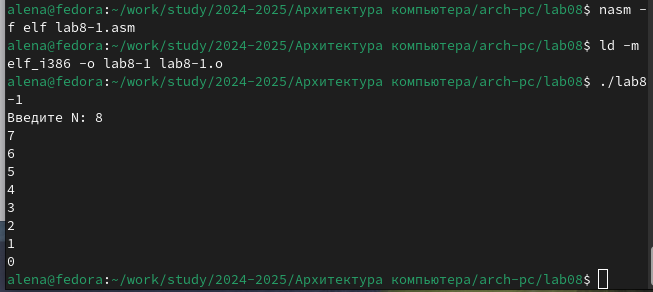{#fig:007 width=70%}

## Обработка аргументов командной строки

Cоздаю новый файл lab8-2.asm и копирую в него код из листинга №2(рис. [-@fig:008]).

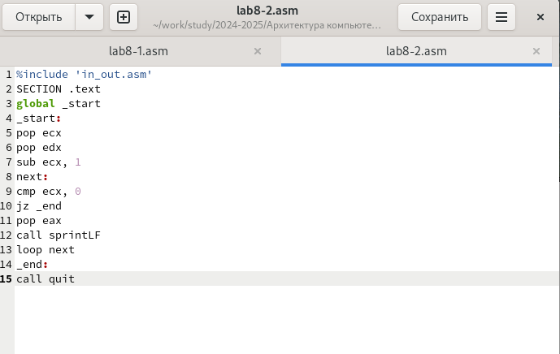{#fig:008 width=70%}

Создаю исполняемый файл и запускаю его, указав аргументы, программа обработала тоже количество аргументов, что и было введено(рис. [-@fig:009]).

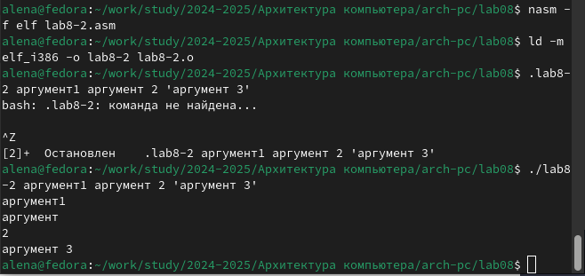{#fig:009 width=70%}

Создаю новый файл lab8-3.asm и ввожу в него текст программы из листинга №3(рис. [-@fig:010]).

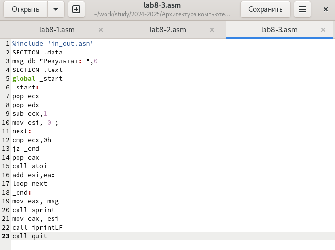{#fig:010 width=70%}

Создаю исполняемый файл и запускаю его, указав аргументы, программа складывает числа(рис. [-@fig:011]).

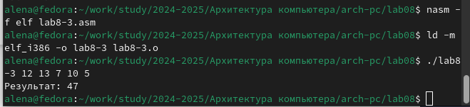{#fig:011 width=70%}

Далее изменяю текст программы для вычисления произведения аргументов(рис. [-@fig:012]).

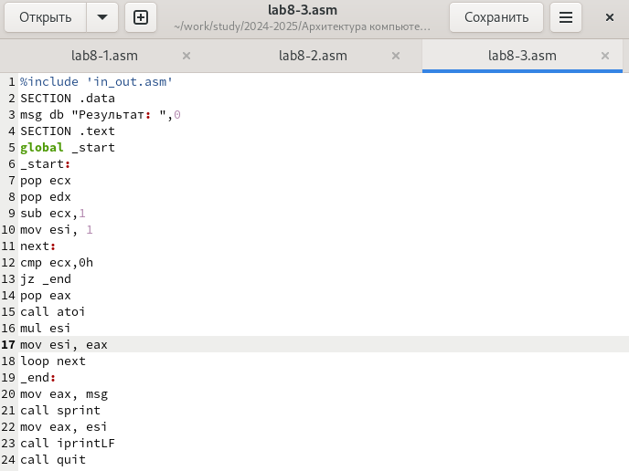{#fig:012 width=70%}

Создаю исполняемый файл и запускаю его, указав аргументы, программа умножает числа(рис. [-@fig:013]).

{#fig:013 width=70%}

## Задание для самостоятельной работы

9 вариант:
Создаю файл lab8-4.asm и пишу программу, которая находит сумму значений функции 10𝑥 − 4(рис. [-@fig:014]).

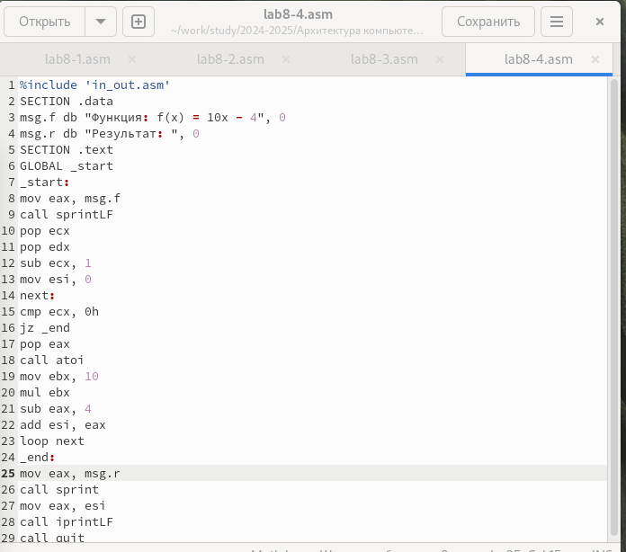{#fig:014 width=70%}

Создаю исполняемый файл и проверяю его работу на нескольких наборах(рис. [-@fig:015]).

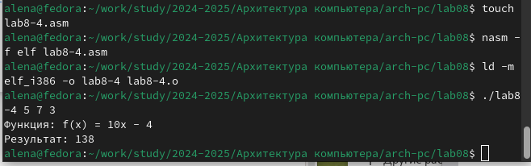{#fig:015 width=70%}

Код программы:

```NASM
%include 'in_out.asm'
SECTION .data
msg.f db "Функция: f(x) = 10x - 4", 0
msg.r db "Результат: ", 0
SECTION .text
GLOBAL _start
_start:
mov eax, msg.f
call sprintLF
pop ecx
pop edx
sub ecx, 1
mov esi, 0
next:
cmp ecx, 0h
jz _end
pop eax
call atoi
mov ebx, 10
mul ebx
sub eax, 4
add esi, eax
loop next
_end: 
mov eax, msg.r
call sprint
mov eax, esi
call iprintLF
call quit
```

# Выводы

При выполнении данной лабораторной работы я приобрела навыки написания программ с использованием циклов и обработкой
аргументов командной строки.


# Список литературы{.unnumbered}

1. [Архитектура ЭВМ](https://esystem.rudn.ru/pluginfile.php/2089095/mod_resource/content/0/%D0%9B%D0%B0%D0%B1%D0%BE%D1%80%D0%B0%D1%82%D0%BE%D1%80%D0%BD%D0%B0%D1%8F%20%D1%80%D0%B0%D0%B1%D0%BE%D1%82%D0%B0%20%E2%84%968.%20%D0%9F%D1%80%D0%BE%D0%B3%D1%80%D0%B0%D0%BC%D0%BC%D0%B8%D1%80%D0%BE%D0%B2%D0%B0%D0%BD%D0%B8%D0%B5%20%D1%86%D0%B8%D0%BA%D0%BB%D0%B0.%20%D0%9E%D0%B1%D1%80%D0%B0%D0%B1%D0%BE%D1%82%D0%BA%D0%B0%20%D0%B0%D1%80%D0%B3%D1%83%D0%BC%D0%B5%D0%BD%D1%82%D0%BE%D0%B2%20%D0%BA%D0%BE%D0%BC%D0%B0%D0%BD%D0%B4%D0%BD%D0%BE%D0%B9%20%D1%81%D1%82%D1%80%D0%BE%D0%BA%D0%B8..pdf)
