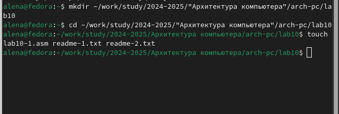
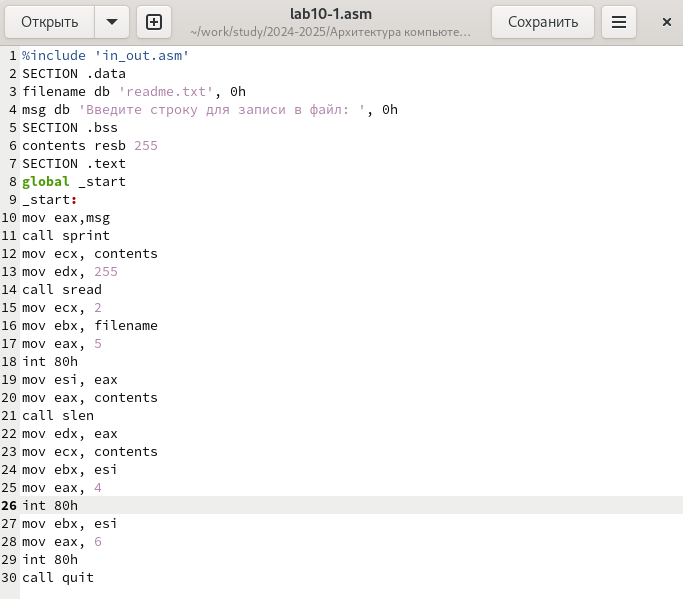
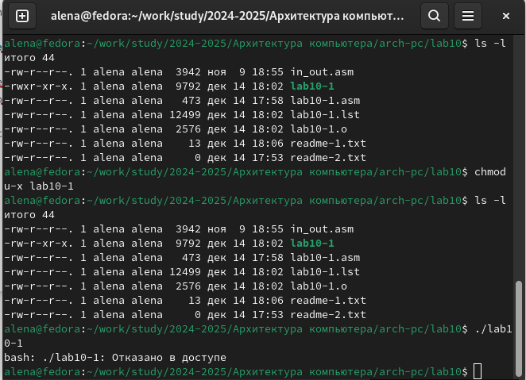
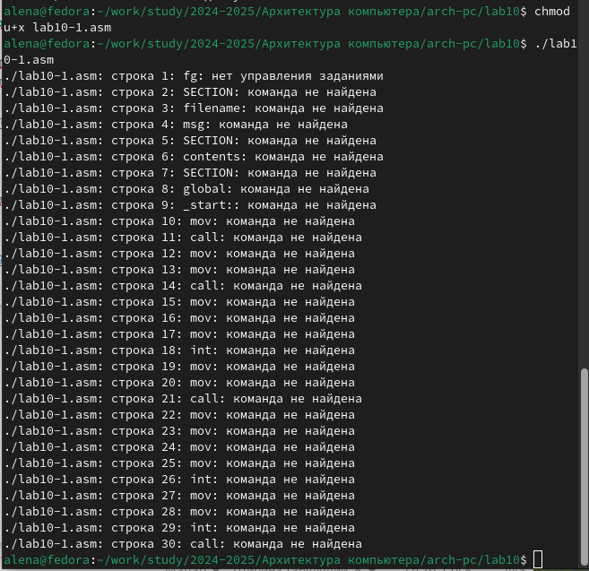
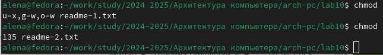
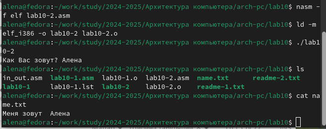

---
## Front matter
title: "Отчёт по лабораторной работе №10"
subtitle: "Дисциплина: архитектура компьютера"
author: "Учаева Алёна Сергеевна"

## Generic otions
lang: ru-RU
toc-title: "Содержание"

## Bibliography
bibliography: bib/cite.bib
csl: pandoc/csl/gost-r-7-0-5-2008-numeric.csl

## Pdf output format
toc: true # Table of contents
toc-depth: 2
lof: true # List of figures
fontsize: 12pt
linestretch: 1.5
papersize: a4
documentclass: scrreprt
## I18n polyglossia
polyglossia-lang:
  name: russian
  options:
	- spelling=modern
	- babelshorthands=true
polyglossia-otherlangs:
  name: english
## I18n babel
babel-lang: russian
babel-otherlangs: english
## Fonts
mainfont: IBM Plex Serif
romanfont: IBM Plex Serif
sansfont: IBM Plex Sans
monofont: IBM Plex Mono
mathfont: STIX Two Math
mainfontoptions: Ligatures=Common,Ligatures=TeX,Scale=0.94
romanfontoptions: Ligatures=Common,Ligatures=TeX,Scale=0.94
sansfontoptions: Ligatures=Common,Ligatures=TeX,Scale=MatchLowercase,Scale=0.94
monofontoptions: Scale=MatchLowercase,Scale=0.94,FakeStretch=0.9
mathfontoptions:
## Biblatex
biblatex: true
biblio-style: "gost-numeric"
biblatexoptions:
  - parentracker=true
  - backend=biber
  - hyperref=auto
  - language=auto
  - autolang=other*
  - citestyle=gost-numeric
## Pandoc-crossref LaTeX customization
figureTitle: "Рис."
listingTitle: "Листинг"
lofTitle: "Список иллюстраций"
lotTitle: "Список таблиц"
lolTitle: "Листинги"
## Misc options
indent: true
header-includes:
  - \usepackage{indentfirst}
  - \usepackage{float} # keep figures where there are in the text
  - \floatplacement{figure}{H} # keep figures where there are in the text
---

# Цель работы

Приобрести навыки написания программ для работы с файлами.

# Задание

1. Создание файлов в программах
2. Изменение прав на файлы для разных групп пользователей
3. Задания для самостоятельной работы

# Теоретическое введение

ОС GNU/Linux является многопользовательской операционной системой. И для обеспече-
ния защиты данных одного пользователя от действий других пользователей существуют
специальные механизмы разграничения доступа к файлам. Кроме ограничения доступа, дан-
ный механизм позволяет разрешить другим пользователям доступ данным для совместной
работы.

# Выполнение лабораторной работы
## Создание файлов в программах

Создаю каталог для программам лабораторной работы № 10, перехожу в него и
создаю файлы lab10-1.asm, readme-1.txt и readme-2.txt(рис. [-@fig:001]).

{#fig:001 width=70%}

Ввожу в файл lab10-1.asm текст программы из листинга 10.1(рис. [-@fig:002]).

{#fig:002 width=70%}

Запускаю программу, она просит на ввод строку, после чего создает текстовый файл с введенной пользователем строкой(рис. [-@fig:003]).

{#fig:003 width=70%}

## Изменение прав на файлы для разных групп пользователей

Меняю права владельца, запретив исполнять файл, после чего система отказывает в исполнении файла, т.к. владелец - запретил исполнять програму(рис. [-@fig:004]).

{#fig:004 width=70%}

Добавляю к исходному файлу программы права владельцу на исполнение,исполняемый текстовый файл интерпретирует каждую строку как команду, так как ни одна из строк не является командой bash, программа абсолютно ничего не делает(рис. [-@fig:005]).

{#fig:005 width=70%}

9 вариант:

Устанавливаю соответсвующие ему права на текстовые файлы, созданные в начале лабораторной работы:

1. В символьном виде для 1-го readme файла --x -w- -w-
2. В двоичной системе для 2-го readme файла 001 011 101

Перевожу группу битов в восьмеричную систему и получаю нужные аргументы для chmod(рис. [-@fig:006]).

{#fig:006 width=70%}

## Задание для самостоятельной работы

Пишу программу, транслириую и компилирую. Программа должна выводить приглашение, просить ввод с клавиатуры и создавать текстовый файл с указанной в программе строкой и вводом пользователя. Запускаю программу, проверяю наличие и содержание созданного текстого файла, программа работает корректно(рис. [-@fig:007]).

{#fig:007 width=70%}

Программа:

```NASM
%include 'in_out.asm'
SECTION .data
filename db 'name.txt', 0
prompt db 'Как Вас зовут?', 0
intro db 'Меня зовут ', 0
SECTION .bss
name resb 255
SECTION .text
global _start
_start:
mov eax, prompt
call sprint
mov ecx, name
mov edx, 255
call sread
mov eax, 8
mov ebx, filename
mov ecx, 0744o
int 80h
mov esi, eax
mov eax, intro
call slen
mov edx, eax
mov ecx, intro
mov ebx, esi
mov eax, 4
int 80h
mov eax, name
call slen
mov edx, eax
mov ecx, name
mov ebx, esi
mov eax, 4
int 80h
mov ebx, esi
mov eax, 6
int 80h
call quit
```

# Выводы

При выполнении данной лабораторной работы я приобрела навыки написания программ для работы с файлами.

# Список литературы{.unnumbered}

1. [Архитектура ЭВМ](https://esystem.rudn.ru/pluginfile.php/2089097/mod_resource/content/0/%D0%9B%D0%B0%D0%B1%D0%BE%D1%80%D0%B0%D1%82%D0%BE%D1%80%D0%BD%D0%B0%D1%8F%20%D1%80%D0%B0%D0%B1%D0%BE%D1%82%D0%B0%20%E2%84%9610.%20%D0%A0%D0%B0%D0%B1%D0%BE%D1%82%D0%B0%20%D1%81%20%D1%84%D0%B0%D0%B9%D0%BB%D0%B0%D0%BC%D0%B8%20%D1%81%D1%80%D0%B5%D0%B4%D1%81%D1%82%D0%B2%D0%B0%D0%BC%D0%B8%20Nasm.pdf)

